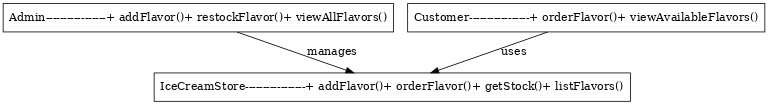

# 🍦 Ice Cream Store Inventory Management (Java + JUnit 5)

A simple **Java-based Ice Cream Store inventory management system** with a **menu-driven CLI** and a **JUnit 5 test suite**.  
This project demonstrates **QA mindset** with both **happy path & edge case testing**, and a design that can **scale to role-based access (Admin vs Customer)**.

---

## 🚀 Features (Current Version)
- Add new flavors with stock (even with **0 stock**, for future restocking).
- Place orders (reduces stock, throws exception if stock < order).
- Check stock for a given flavor.
- List all available flavors (admin-style view).
- Input-driven CLI for manual demo.
- Fully tested with **JUnit 5** (6/6 test cases passed).
- **Note:** Current version functions as an **Inventory Management System (Admin-facing)** where all flavors (including stock = 0) are visible.  
  In future **Customer-facing mode**, out-of-stock flavors will be hidden.

---

## 📸 Example CLI Demo
```
🍦 Welcome to Ice Cream Store! 🍦

Choose an option:
1. Add Flavor
2. Order Flavor
3. Check Stock
4. List Flavors
5. Exit
Enter choice: 1
Enter flavor name: Vanilla
Enter stock quantity: 10
Vanilla added with stock 10

Choose an option: 4
Available flavors: Vanilla

Choose an option: 2
Enter flavor to order: Vanilla
Enter quantity: 3
Order successful! Remaining stock: 7
```

---

## 🧪 Running Tests (JUnit 5 with JDK 11)

### 1. Compile code + tests:
```bash
javac -cp .:junit-platform-console-standalone-1.9.2.jar *.java
```

### 2. Run all tests:
```bash
java -jar junit-platform-console-standalone-1.9.2.jar -cp . --scan-class-path
```

✅ Expected Output (sample):
```
Thanks for using JUnit! Support its development at https://junit.org/sponsoring

╷
├─ JUnit Jupiter ✔
│  └─ IceCreamStoreTest ✔
│     ├─ testOrderFlavorInsufficientStock() ✔
│     ├─ testOrderInvalidFlavor() ✔
│     ├─ testListFlavors() ✔
│     ├─ testOrderFlavorSuccess() ✔
│     ├─ testAddFlavorAndGetStock() ✔
│     └─ testNegativeStockAddition() ✔
├─ JUnit Vintage ✔
└─ JUnit Platform Suite ✔

Test run finished after 25 ms
[         6 tests successful ]
```

---

## 📊 UML Diagram (Current & Future Scope)



- **IceCreamStore** → Core inventory system (add, order, stock mgmt).  
- **Admin** → Manages flavors, can see/edit **all flavors** (even stock = 0).  
- **Customer** → Can only order and view flavors **with stock > 0**.  

---

## 🔮 Scalability & Future Scope
Currently the system works as an **Inventory Management Tool (Admin-facing)**.  
Future improvements will add **Role-Based Access Control (RBAC):**

- **Admin role**  
  - Add / restock flavors  
  - View all flavors (including stock = 0)  
- **Customer role**  
  - Place orders  
  - View only available flavors (stock > 0)  

Other planned enhancements:
- Persistent storage (DB integration).  
- Web-based interface (Spring Boot or Flask backend).  
- Analytics dashboard (most sold flavors, low stock alerts).  

---

## 📌 Tech Stack
- **Java (JDK 11)** – Core logic
- **JUnit 5** – Testing framework
- **HashMap** – In-memory inventory store
- **CLI** – User interaction

---

## 🏆 Why This Project?
- Demonstrates **problem-solving + testing mindset**.  
- Covers **edge cases and exceptions** (invalid inputs, insufficient stock).  
- Shows ability to **design scalable systems** (Admin vs Customer roles).  
- Perfect showcase for **QA Intern / Software Engineer Intern** roles.

---
